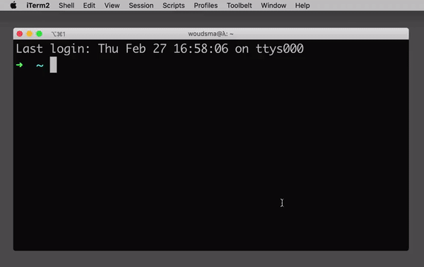

# Workspaces CLI  
  

A small command-line tool to easily list all your different VS Code Workspaces.  

`ws` searches for all `.code-workspace` files in a user-specified root directory.  
By default, `ws` searches only 1 level deep to prevent traversing folders like `node-modules`, `vendor`, etc.



---
## Installation  
```sh
npm i -g @woudsma/workspaces-cli
```

## Requirements  
Make sure you have installed the `code` command in your `$PATH`.  
**[How to](https://code.visualstudio.com/docs/setup/mac#_launching-from-the-command-line)**

## Usage  
Create a workspace by opening a project in VS Code, optionally add more projects to your current workspace.  
Save the workspace with:  
```
File -> Save Workspace As...
```

I've made a `_workspaces` folder in my personal projects folder, where I keep workspaces that include multiple projects. Other workspaces are usually stored in their own project folder. `ws` searches 1 level deep.  
Example:
```
$ ws
Workspaces root directory: /Users/woudsma/Projects
? Select workspace …
❯ _workspaces/hasura-test
  _workspaces/kirby-react-test
  _workspaces/mount-spaces
  workspaces-cli/workspaces-cli
```
For example, the workspace for this project is saved at `/Users/woudsma/Projects/workspaces-cli/workspaces-cli.code-workspace`.  

`ws` is an alias of `workspaces`.  

## First time configuration  
`ws` reads your workspaces root directory from `~/.workspacesrc`.  
If no configuration can be found, `ws` will try to create a `~/.workspacesrc` file with the workspaces root directory that you've provided.  
```
$ ws
No configuration found in /Users/woudsma/.workspacesrc
Creating /Users/woudsma/.workspacesrc
? Enter workspaces root directory, e.g. ~/Projects › ~/
```
## Configuration  
Multiple root directories can be specified by adding them to `WORKSPACES_ROOT_DIR` in `~/.workspacesrc`, seperated by comma.  
Example:
```
WORKSPACES_ROOT_DIR=/Users/woudsma/Projects,/Users/woudsma/Company/clients
```

The default search depth can be changed by adding `READDIR_DEPTH=<depth>` to `~/.workspacesrc`.
```sh
# Recommended READDIR_DEPTH=1 (default)
echo READDIR_DEPTH=2 >> ~/.workspacesrc
```
